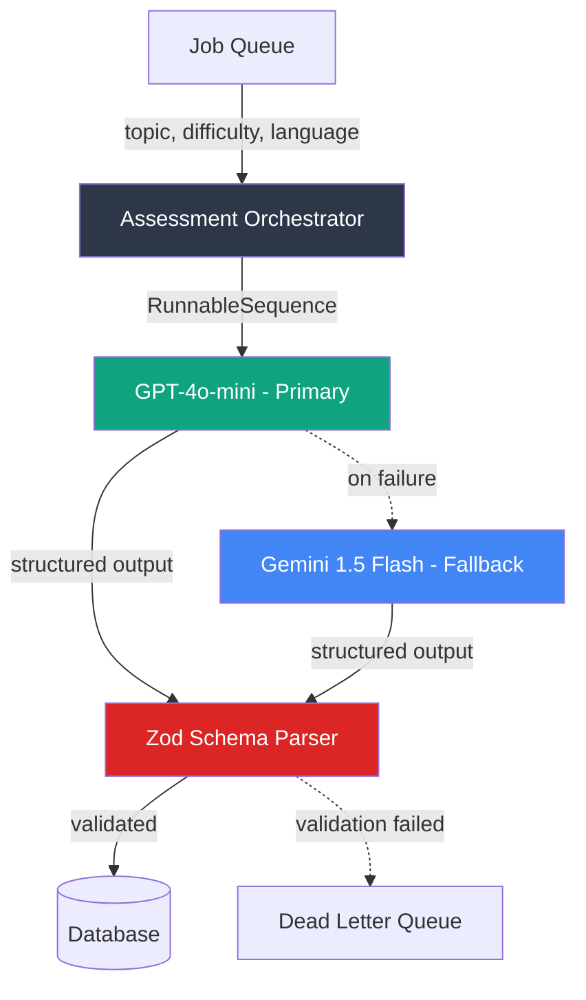

# LLM Assessment Pipeline

A fault-tolerant LLM orchestration engine built on LangChain that generates structured assessment content using a dual-model architecture (OpenAI GPT-4o + Google Gemini fallback) with Zod-validated output schemas.

## Problem

LLM APIs are unreliable. Rate limits, transient errors, and malformed outputs are expected at scale. A single-provider pipeline means a provider outage halts your entire content generation workflow.

This pipeline uses dual-model failover: primary generation via GPT-4o-mini with automatic fallback routing to Gemini 1.5 Flash on failure. All outputs are validated against a strict Zod schema before persistence -- no malformed data reaches the database.

## Architecture



**Key architectural decisions:**
- **Dual-model failover**: GPT-4o-mini handles primary generation (higher reasoning quality). On any failure (rate limit, timeout, malformed output), the entire chain re-executes against Gemini 1.5 Flash. No partial results -- full re-generation on fallback.
- **Schema-first output**: Zod schema defines the exact output shape before any LLM call. `StructuredOutputParser` injects format instructions into the prompt and validates the response. Malformed LLM output throws before reaching persistence.
- **RunnableSequence composition**: LangChain's LCEL chains prompt -> model -> parser as a single executable unit. Swapping models or adding post-processing steps is a one-line change.

## Tech Stack

| Technology | Why |
|---|---|
| **LangChain 1.2.x** | Composable chain abstraction. RunnableSequence enables swapping models/parsers without rewriting orchestration logic. |
| **GPT-4o-mini** | High reasoning quality at low cost. `temperature: 0.2` for deterministic technical content. 2 retries built in. |
| **Gemini 1.5 Flash** | Fast, cheap fallback. `temperature: 0.1` for maximum consistency. Different provider eliminates correlated failures. |
| **Zod 4.x** | Runtime schema validation with TypeScript type inference. Single source of truth for both validation and types. |

## Key Features

- **Dual-model failover** -- automatic routing from OpenAI to Gemini on any primary chain failure
- **Zod-validated structured output** -- 4-option MCQ schema enforced at parse time, not after persistence
- **Configurable difficulty and language** -- supports multilingual generation with difficulty targeting
- **LangChain composition** -- prompt, model, and parser composed as a single RunnableSequence
- **Retry logic** -- 2 retries per model before failover, preventing unnecessary fallback on transient errors
- **Type-safe payloads** -- `AssessmentQuestion` type inferred directly from Zod schema

## Output Schema

```typescript
{
  questionText: string,       // min 10 chars
  options: [                  // exactly 4
    { id: "a", text: string, isCorrect: boolean },
    { id: "b", text: string, isCorrect: boolean },
    { id: "c", text: string, isCorrect: boolean },
    { id: "d", text: string, isCorrect: boolean }
  ],
  explanation: string,
  difficulty: "beginner" | "intermediate" | "advanced",
  language: string            // locale code (en, es, fr)
}
```

## Failure Handling

1. **GPT-4o transient error** -- 2 automatic retries with LangChain's built-in retry logic
2. **GPT-4o persistent failure** -- entire chain re-executes against Gemini 1.5 Flash
3. **Malformed LLM output** -- Zod parser throws before data reaches any persistence layer
4. **Both models fail** -- error propagated to caller for DLQ routing
5. **Rate limiting** -- low temperature + retries absorb most transient 429s; failover handles prolonged outages

## Scale Considerations

| Dimension | Current | Production Path |
|---|---|---|
| **Throughput** | Sequential job processing | Parallelize with BullMQ workers from [distributed-queue-engine](https://github.com/sudhanshu1402/distributed-queue-engine) |
| **Cost optimization** | GPT-4o-mini primary | Route simple topics to Gemini-only; reserve GPT-4o for advanced difficulty |
| **Caching** | None | Add semantic cache (embedding similarity) to skip LLM calls for near-duplicate topics |
| **Observability** | Console logging | Integrate [otel-sdk-node](https://github.com/sudhanshu1402/otel-sdk-node) for per-generation tracing |

## Setup

```bash
npm install
cp .env.example .env  # Add OPENAI_API_KEY and GOOGLE_API_KEY
npm run dev
```

## Future Improvements

- [ ] Parallel dual-model execution with consensus (generate from both, compare, pick best)
- [ ] Semantic deduplication cache to avoid regenerating similar topics
- [ ] Streaming output for real-time progress in long-form generation
- [ ] Cost tracking per generation (token usage + model pricing)
- [ ] A/B testing framework for prompt variants

## Deep-Dive Architecture

For a complete system design breakdown with Mermaid diagrams, visit the [System Design Portal](https://sudhanshu1402.github.io/system-design-portal/llm-pipeline).

## License

MIT

