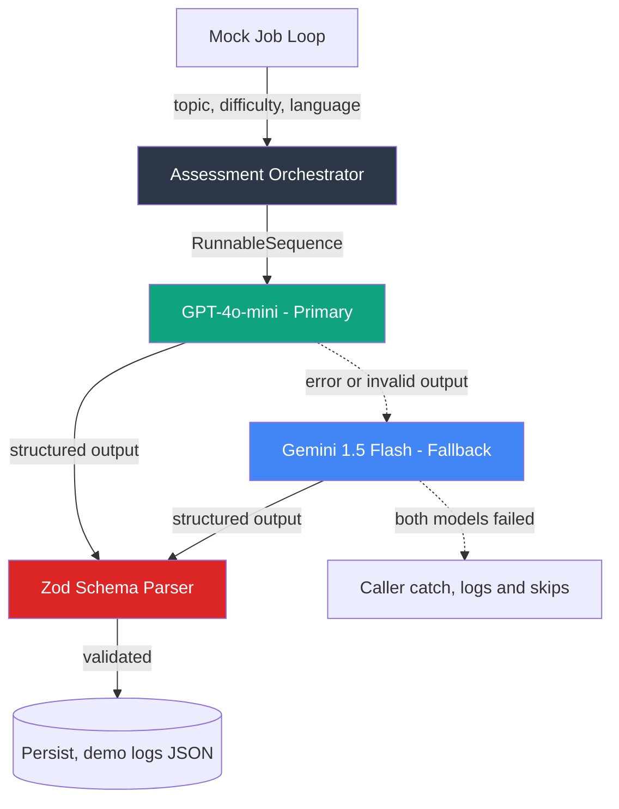

<h1>
<picture>
  <source media="(prefers-color-scheme: dark)" srcset="https://raw.githubusercontent.com/sudhanshu1402/llm-assessment-pipeline/main/assets/banner-dark.svg" />
  <source media="(prefers-color-scheme: light)" srcset="https://raw.githubusercontent.com/sudhanshu1402/llm-assessment-pipeline/main/assets/banner-light.svg" />
  
</picture>
</h1>

[](https://github.com/sudhanshu1402/llm-assessment-pipeline/actions/workflows/ci.yml) [](LICENSE)


Generates multiple-choice questions from an LLM (LangChain + OpenAI + Gemini), validates them against a strict Zod schema, and fails over to a second provider when the primary breaks. The failover and schema validation are real, test-covered code paths. The job queue is a mock in-process loop and persistence is a console log. Point it at a real queue like [distributed-queue-engine](https://github.com/sudhanshu1402/distributed-queue-engine) and a database to run it for real.

## The problem

LLM APIs fail on a normal Tuesday: rate limits, timeouts, output that's almost-but-not-quite valid JSON. One provider means one outage stops everything; almost-valid JSON quietly poisons a data store. Primary generation runs on GPT-4o-mini; any failure re-runs the chain against Gemini 1.5 Flash, and everything is parsed through Zod before it counts as done.

## Architecture


```mermaid
graph TB
    Queue[Mock Job Loop] -->|topic, difficulty, language| Orchestrator[Assessment Orchestrator]
    Orchestrator -->|RunnableSequence| Primary[GPT-4o-mini - Primary]
    Primary -->|structured output| Parser[Zod Schema Parser]
    Primary -.->|error or invalid output| Fallback[Gemini 1.5 Flash - Fallback]
    Fallback -->|structured output| Parser
    Parser -->|validated| DB[(Persist, demo logs JSON)]
    Fallback -.->|both models failed| Caller[Caller catch, logs and skips]

    style Orchestrator fill:#2d3748,color:#fff
    style Primary fill:#10a37f,color:#fff
    style Fallback fill:#4285f4,color:#fff
    style Parser fill:#dc2626,color:#fff
```

## Output shape

| Field | Constraint |
|---|---|
| `questionText` | string, min 10 chars |
| `options` | exactly 4, exactly one `isCorrect: true` |
| `explanation` | string |
| `difficulty` | `"beginner" \| "intermediate" \| "advanced"` |
| `language` | locale code |

Wording varies per generation; the shape doesn't. Design rationale (sequential failover, schema-before-prompt): [docs/DEEPDIVE.md](docs/DEEPDIVE.md).

## Proof it runs


Captured output, not typed text: `npm run assets` runs `scripts/demo-schema.ts`, which puts both payloads through `AssessmentQuestionSchema.safeParse` from `src/schema.ts`, then runs the suite. Every LangChain client is mocked, so this is a mocked-provider run, not a live model call.

```bash
npm test
```

`schema.test.ts` covers the validation boundaries; `pipeline.test.ts` stubs `RunnableSequence.from` to prove the fallback only fires on a primary failure. CI runs the suite on Node 20 and 22, and regenerates `assets/*.svg` to catch drift.

## Run it

Node 20.19 or newer.

```bash
npm install
cp .env.example .env    # OPENAI_API_KEY + a Google Generative AI key
npm run dev
```

`LANGCHAIN_*` entries are optional, for LangSmith tracing. This runs the mock loop in `src/index.ts`: two hardcoded jobs, validated JSON printed for each.

```typescript
const orchestrator = new AssessmentOrchestrator();
const question = await orchestrator.generateQuestion(
  'React Context API Performance', 'advanced', 'English'
);
```

## More

| | |
|---|---|
| [docs/DEEPDIVE.md](docs/DEEPDIVE.md) | design decisions, deploy, known gaps |
| [System Design Portal](https://sudhanshu1402.github.io/system-design-portal/llm-pipeline) | full write-up |

## License

MIT
