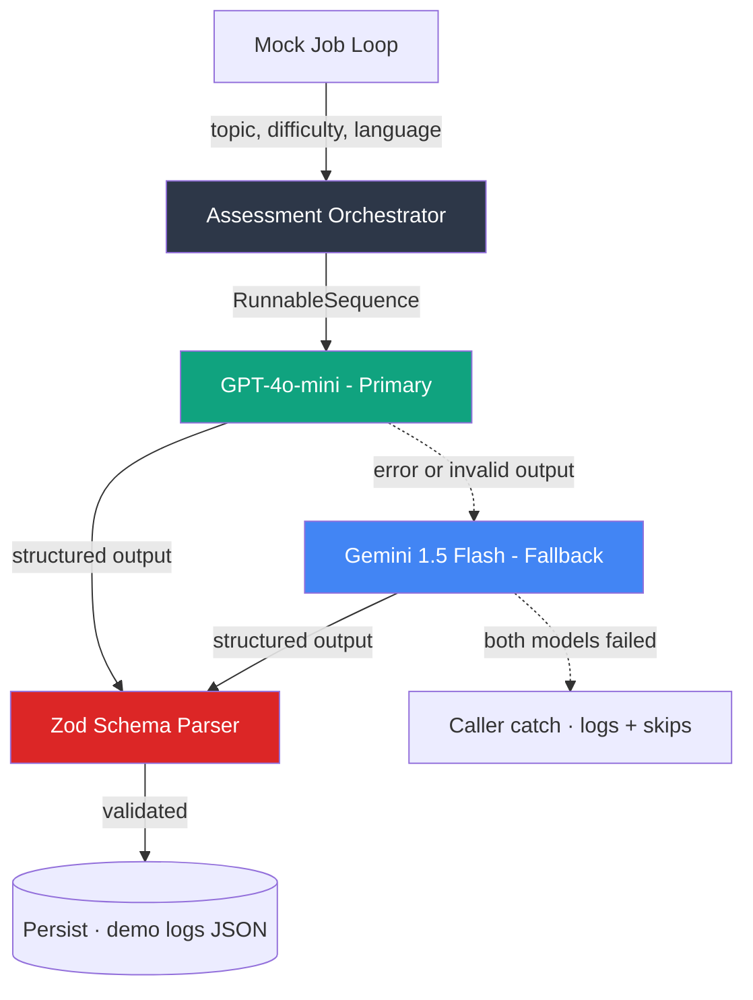

# LLM Assessment Pipeline

[](https://github.com/sudhanshu1402/llm-assessment-pipeline/actions/workflows/ci.yml) [](LICENSE)

A LangChain demo that generates multiple-choice assessment questions from an LLM, validates them against a strict Zod schema, and fails over from OpenAI to Gemini when the primary model errors out.

> **Scope:** a focused reference implementation of the *failover + schema-validation* pattern. The dual-model failover and Zod parsing are real; the "job queue" is a mock in-process loop (`src/index.ts`) and persistence is simulated with a console log. Wire it to a real queue (e.g. [distributed-queue-engine](https://github.com/sudhanshu1402/distributed-queue-engine)) and a database to run it for real.

## Problem

LLM APIs fail. Rate limits, transient errors, and malformed outputs are all routine at scale. A single-provider pipeline means one provider's outage stops your whole content workflow, and a model that returns almost-valid JSON can quietly poison your data store.

This pipeline addresses both. Primary generation runs on GPT-4o-mini; on any failure the same chain re-runs against Gemini 1.5 Flash. Every result is parsed through a Zod schema before it counts as done, so malformed output throws instead of being persisted.

## Architecture


```mermaid
graph TB
    Queue[Mock Job Loop] -->|topic, difficulty, language| Orchestrator[Assessment Orchestrator]
    Orchestrator -->|RunnableSequence| Primary[GPT-4o-mini - Primary]
    Primary -->|structured output| Parser[Zod Schema Parser]
    Primary -.->|error or invalid output| Fallback[Gemini 1.5 Flash - Fallback]
    Fallback -->|structured output| Parser
    Parser -->|validated| DB[(Persist · demo logs JSON)]
    Fallback -.->|both models failed| Caller[Caller catch · logs + skips]

    style Orchestrator fill:#2d3748,color:#fff
    style Primary fill:#10a37f,color:#fff
    style Fallback fill:#4285f4,color:#fff
    style Parser fill:#dc2626,color:#fff
```

The `AssessmentOrchestrator` (`src/pipeline.ts`) builds a `RunnableSequence` of prompt → model → parser. `generateQuestion()` invokes the primary chain inside a `try`; on any thrown error it constructs a second chain against Gemini and re-runs with the identical inputs. This is **sequential failover, not parallel consensus** — only one model's output is ever returned. If both throw, the error propagates to the caller.

**Design decisions worth noting:**

- **Dual-model failover.** GPT-4o-mini handles primary generation for reasoning quality. On any failure — rate limit, timeout, or output that fails Zod validation — the whole chain re-executes against Gemini 1.5 Flash. Full re-generation, no partial merge.
- **Schema-first output.** The Zod schema (`src/schema.ts`) defines the exact shape before any LLM call. `StructuredOutputParser` derives format instructions from it (injected into the prompt) and validates the response coming back. A `.refine()` enforces exactly one correct option — the LLM can emit zero or several, and those are rejected before storage.
- **RunnableSequence composition.** LangChain's LCEL chains prompt, model, and parser into one executable unit, so swapping a model or adding a post-processing step is a small change.

## Tech Stack

| Technology | Why |
|---|---|
| **LangChain 1.x** (`@langchain/core`, `langchain`) | Composable chain abstraction. `RunnableSequence` lets you swap models/parsers without rewriting orchestration. |
| **GPT-4o-mini** via `@langchain/openai` | Primary model. `temperature: 0.2`, `maxRetries: 2` for stable technical content. |
| **Gemini 1.5 Flash** via `@langchain/google-genai` | Fallback model. `temperature: 0.1`, `maxRetries: 2`. A different provider avoids correlated failures. |
| **Zod 4.x** | Runtime validation with inferred TypeScript types — one source of truth for both. |
| **TypeScript 5.x** | Strict mode, compiled to CommonJS via `tsc`. |
| **Vitest** | Unit tests for the schema and the failover logic, with all LLM calls mocked. |

## Output Schema

Defined in `src/schema.ts`. `AssessmentQuestion` is inferred from it directly.

```typescript
{
  questionText: string,       // min 10 chars
  options: [                  // exactly 4, exactly one isCorrect: true
    { id: string, text: string, isCorrect: boolean },
    { id: string, text: string, isCorrect: boolean },
    { id: string, text: string, isCorrect: boolean },
    { id: string, text: string, isCorrect: boolean }
  ],
  explanation: string,
  difficulty: "beginner" | "intermediate" | "advanced",
  language: string            // locale code (e.g. en, es, fr)
}
```

## Setup

Requires Node 22 (see `.nvmrc`).

```bash
npm install
cp .env.example .env   # fill in OPENAI_API_KEY and your Google/Gemini key
```

`.env.example` lists the keys the pipeline reads: `OPENAI_API_KEY` for the primary model and a Google Generative AI key for the fallback. The two `LANGCHAIN_*` entries are optional and only enable LangSmith tracing.

## Build & Run

```bash
npm run dev      # ts-node + nodemon, watches src/
npm run build    # tsc -> dist/
npm start        # node dist/index.js
npm test         # vitest run
```

Running the pipeline executes the mock job loop in `src/index.ts`, which processes two hardcoded jobs and prints the validated JSON for each.

## Usage Example

The demo loop feeds jobs like this to the orchestrator:

```typescript
const orchestrator = new AssessmentOrchestrator();

const question = await orchestrator.generateQuestion(
  'React Context API Performance', // topic
  'advanced',                      // difficulty
  'English'                        // language
);
```

A successful run logs the generated question after Zod validation:

```json
{
  "questionText": "Which re-render behavior is caused by placing a frequently-changing value directly in a Context Provider's value prop?",
  "options": [
    { "id": "a", "text": "Only components reading that value re-render", "isCorrect": true },
    { "id": "b", "text": "The entire app re-renders every tick", "isCorrect": false },
    { "id": "c", "text": "Nothing re-renders until a state flush", "isCorrect": false },
    { "id": "d", "text": "Providers cannot hold changing values", "isCorrect": false }
  ],
  "explanation": "A new value reference on the Provider re-renders all consuming components...",
  "difficulty": "advanced",
  "language": "en"
}
```

(Exact wording varies per generation; the shape does not — the parser guarantees it.)

## Failure Handling

1. **GPT-4o-mini transient error** — up to 2 automatic retries via LangChain's built-in `maxRetries`.
2. **GPT-4o-mini persistent failure** — the entire chain re-executes against Gemini 1.5 Flash.
3. **Malformed LLM output** — the Zod parser throws before the data reaches any persistence layer.
4. **Both models fail** — the error propagates to the job loop's `catch`, which logs and skips the job. A production worker would route it to a dead-letter queue instead.

## Tests

`npm test` runs the Vitest suite. Every LLM and LangChain dependency is mocked, so the tests need **no API keys and make no network calls**.

- **`tests/schema.test.ts`** — validation boundaries: `questionText` length, exactly-4 options, the exactly-one-correct `.refine()`, difficulty enum (case-sensitive), missing/wrong-typed fields, and null/empty input.
- **`tests/pipeline.test.ts`** — the failover logic. It stubs `RunnableSequence.from` to control each chain's `invoke`, then asserts: primary success returns without touching the fallback; a primary throw routes to Gemini with the same inputs; both failing propagates the error (the DLQ path); and a warning is logged on fallback.

## Deployment

- **`Dockerfile`** — multi-stage build (Node 22 Alpine): compile in a builder stage, then copy `dist/` into a slim production image running as a non-root `node` user.
- **`render.yaml`** — a Render web-service blueprint (build with dev deps, `npm start`).
- **`.github/workflows/ci.yml`** — CI on push/PR to `main` across Node 20 and 22: `npm ci`, build, test.

## Scale Considerations

| Dimension | Current | Production Path |
|---|---|---|
| **Throughput** | Sequential job processing | Parallelize with workers from [distributed-queue-engine](https://github.com/sudhanshu1402/distributed-queue-engine) |
| **Cost** | GPT-4o-mini primary | Route simple topics to Gemini-only; reserve GPT-4o for advanced difficulty |
| **Caching** | None | Semantic cache (embedding similarity) to skip near-duplicate topics |
| **Observability** | Console logging | [otel-sdk-node](https://github.com/sudhanshu1402/otel-sdk-node) for per-generation tracing |

## Future Improvements

- [ ] Parallel dual-model execution with consensus (generate from both, compare, pick best)
- [ ] Semantic deduplication cache
- [ ] Streaming output for long-form generation
- [ ] Cost tracking per generation (token usage + model pricing)
- [ ] A/B testing framework for prompt variants

## Deep-Dive Architecture

For a full system-design breakdown with diagrams, see the [System Design Portal](https://sudhanshu1402.github.io/system-design-portal/llm-pipeline).

## License

MIT
