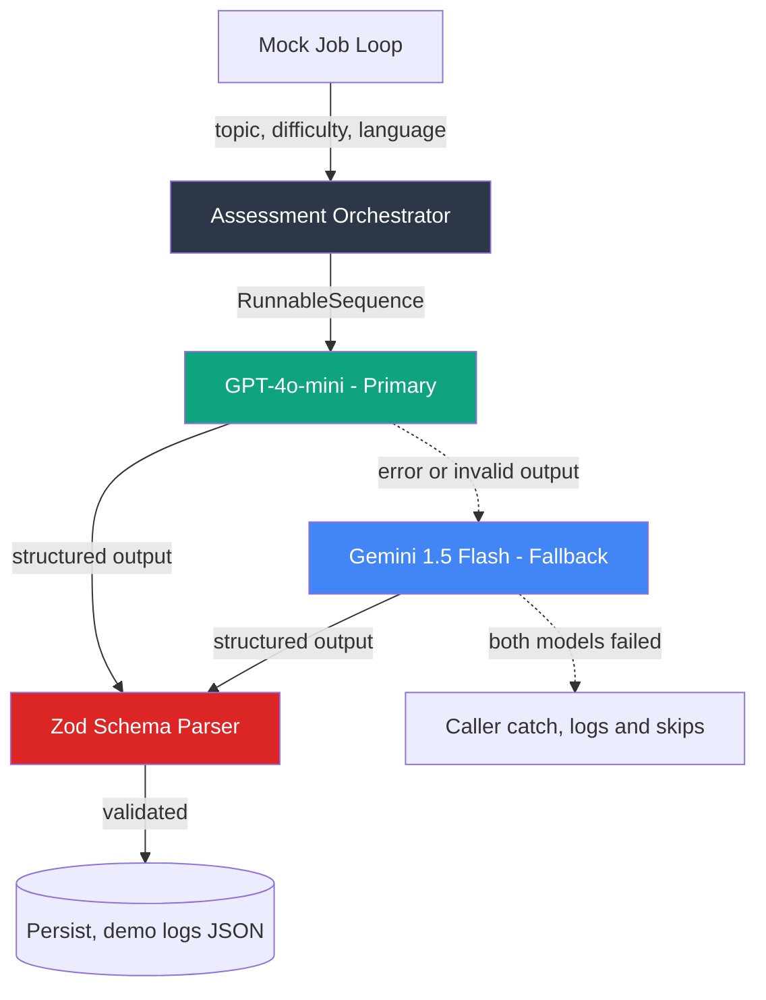

<h1>
<picture>
  <source media="(prefers-color-scheme: dark)" srcset="https://raw.githubusercontent.com/sudhanshu1402/llm-assessment-pipeline/main/assets/banner-dark.svg" />
  <source media="(prefers-color-scheme: light)" srcset="https://raw.githubusercontent.com/sudhanshu1402/llm-assessment-pipeline/main/assets/banner-light.svg" />
  
</picture>
</h1>

[](https://github.com/sudhanshu1402/llm-assessment-pipeline/actions/workflows/ci.yml) [](LICENSE)

Generates multiple-choice questions from an LLM, validates them against a strict Zod schema, and fails over from OpenAI to Gemini when the primary model breaks.

The failover and schema validation are real. The job queue is a mock in-process loop and persistence is a console log. Point it at a real queue like [distributed-queue-engine](https://github.com/sudhanshu1402/distributed-queue-engine) and a database to run it for real.

## The problem

LLM APIs fail on a normal Tuesday: rate limits, timeouts, and output that's almost-but-not-quite valid JSON. One provider means one outage stops everything, and almost-valid JSON quietly poisons your data store.

Primary generation runs on GPT-4o-mini. Any failure re-runs the whole chain against Gemini 1.5 Flash. Everything is parsed through Zod before it counts as done, so malformed output throws instead of being saved.

## Architecture


```mermaid
graph TB
    Queue[Mock Job Loop] -->|topic, difficulty, language| Orchestrator[Assessment Orchestrator]
    Orchestrator -->|RunnableSequence| Primary[GPT-4o-mini - Primary]
    Primary -->|structured output| Parser[Zod Schema Parser]
    Primary -.->|error or invalid output| Fallback[Gemini 1.5 Flash - Fallback]
    Fallback -->|structured output| Parser
    Parser -->|validated| DB[(Persist, demo logs JSON)]
    Fallback -.->|both models failed| Caller[Caller catch, logs and skips]

    style Orchestrator fill:#2d3748,color:#fff
    style Primary fill:#10a37f,color:#fff
    style Fallback fill:#4285f4,color:#fff
    style Parser fill:#dc2626,color:#fff
```

## Three decisions worth reading

**Sequential failover, not parallel consensus.** `generateQuestion()` invokes the primary chain in a `try`; on any throw it builds a second chain against Gemini and re-runs with identical inputs. Only one model's output is ever returned. Both failing propagates to the caller. Different provider on purpose, so an OpenAI incident doesn't take the fallback with it.

**Schema before prompt.** The Zod schema in `src/schema.ts` is defined first, and `StructuredOutputParser` derives the prompt's format instructions from it. One source of truth for the instruction and the validation.

**A `.refine()` catches the failure mode that matters.** The LLM will occasionally emit zero correct options, or three. The refinement enforces exactly one, and a violation is rejected before anything is stored.

## Output shape

```typescript
{
  questionText: string,       // min 10 chars
  options: [                  // exactly 4, exactly one isCorrect: true
    { id: string, text: string, isCorrect: boolean }, // x4
  ],
  explanation: string,
  difficulty: "beginner" | "intermediate" | "advanced",
  language: string            // locale code
}
```

Wording varies per generation. The shape doesn't, because the parser won't let it.

## Run it

Node 20.19 or newer.

```bash
npm install
cp .env.example .env    # OPENAI_API_KEY + a Google Generative AI key
npm run dev
```

The `LANGCHAIN_*` entries in `.env.example` are optional, only for LangSmith tracing. Running it executes the mock loop in `src/index.ts`: two hardcoded jobs, validated JSON printed for each.

```typescript
const orchestrator = new AssessmentOrchestrator();
const question = await orchestrator.generateQuestion(
  'React Context API Performance', 'advanced', 'English'
);
```

## Tests

```bash
npm test
```

No API keys, no network. Every LLM dependency is mocked. `schema.test.ts` hits the validation boundaries including the exactly-one-correct refinement and the case-sensitive difficulty enum. `pipeline.test.ts` stubs `RunnableSequence.from` to control each chain, then asserts primary success never touches the fallback, a primary throw reaches Gemini with the same inputs, and both failing propagates. CI on Node 20 and 22.

## Deploy

Multi-stage `Dockerfile` on Node 22 Alpine, non-root user. `render.yaml` included.

## What it doesn't do

- Jobs run sequentially. Throughput needs real workers.
- No caching, so two near-identical topics both cost a full generation.
- No cost tracking. Token usage per generation isn't recorded anywhere.
- Console logging only. Per-generation tracing would come from [otel-sdk-node](https://github.com/sudhanshu1402/otel-sdk-node).
- Both models failing just logs and skips. A production worker needs a dead-letter queue.
- No streaming, so long generations block until complete.

## Deep-dive

Full breakdown at the [System Design Portal](https://sudhanshu1402.github.io/system-design-portal/llm-pipeline).

## License

MIT
